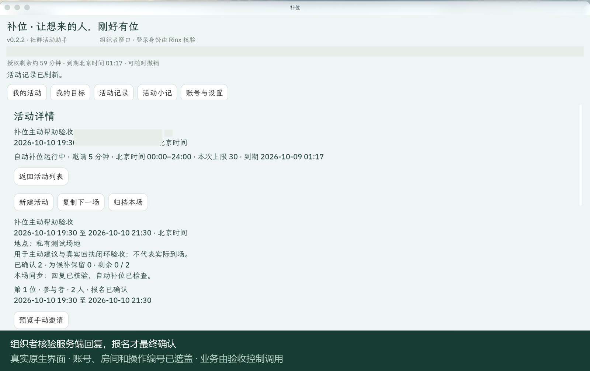

# 补位 BuWei

让想来的人，刚好有位。

补位帮助羽毛球、桌游、读书会等社群组织者管理报名、候补和临时补位。
成员使用自己的 Rinx 身份报名和回复，组织者从活动页面查看名额及结果。

作者 **WeiR-h** · 队伍 **生生不息** · Apache-2.0

## 实际效果

从创建活动、分享卡片，到报名、候补和本人接受，在一个活动页面内完成。

- 同时管理最多五场活动，每场最多 30 个名额；支持完整日期、分钟和跨午夜时段。
- 同行 1–8 人整组报名。名额不足时保留排位，人数合适时再邀请。
- 确认本场规则后自动补位，分别显示名额保留、邀请送达和本人接受。
- AI 帮助生成活动草稿、理解报名、解释候补和准备有事实依据的活动小记。
- 发送中断后沿原操作编号核实结果，避免重复邀请或发布。



## 下载

[下载 v0.2.2 Windows 宿主升级预览](https://github.com/WeiR-h/buwei/releases/tag/v0.2.2)

[下载正式 Windows 版本](https://github.com/WeiR-h/buwei/releases/latest)

正式下载以 Release 标注的版本为准。

v0.2.2 源码接入新版官方 OctoSense 与 Rinx 1.1.0。“我的目标”保存本人安排和明确确认的偏好，主动提示人数缺口、合适活动、待回复邀请与时间冲突。建议衔接持续任务；用户可开启托盘值守，明确反馈只更新选定范围，按本人周期准备下一场草稿。操作继续使用授权与回执流程。运行包的发布状态以 Release 页面为准。

[目标、主动建议与值守](docs/INTENTIONS.md)

[三分钟主动帮助操作讲解](assets/proactive/BuWei-proactive-walkthrough.mp4) · [App Hub 接入审核](https://github.com/OctoSense-org/OctoSense-App-Hub/issues/110)

运行环境：Windows 10/11 x64，微软 Visual C++ v14 x64 运行库。
应用基于官方 OctoSense / Rinx 原生宿主，提供组织者和参与者入口。

## 三步开始

1. 解压运行包，打开组织者或参与者入口，在 Rinx 完成本人登录。
2. 打开补位，核对账号并确认所需权限。
3. 组织者创建活动并分享卡片；参与者从卡片进入报名，收到邀请后确认自己的回复。

[使用指南](docs/FIRST-RUN.md) · [隐私说明](docs/PRIVACY.md)

## 源码构建

```powershell
git clone https://github.com/WeiR-h/buwei.git
cd buwei
python tools/bootstrap.py
./tools/Build.ps1 -Tests
./tools/Build.ps1
```

构建需要 Windows x64、Git、Python 3.12+、Rust 1.98.0、Visual Studio C++ 桌面工具和 Windows SDK。
首次构建会获取固定版本的官方依赖。运行与模型配置步骤见使用指南。

核心包含可复用的授权、持久化执行与回执框架，应用源码和必要的构建补丁完整提供。

[English](README.en.md) · [版本记录](CHANGELOG.md) · [第三方声明](NOTICE.md) ·
[问题反馈](https://github.com/WeiR-h/buwei/issues) · [参赛说明](docs/SUBMISSION.md)
